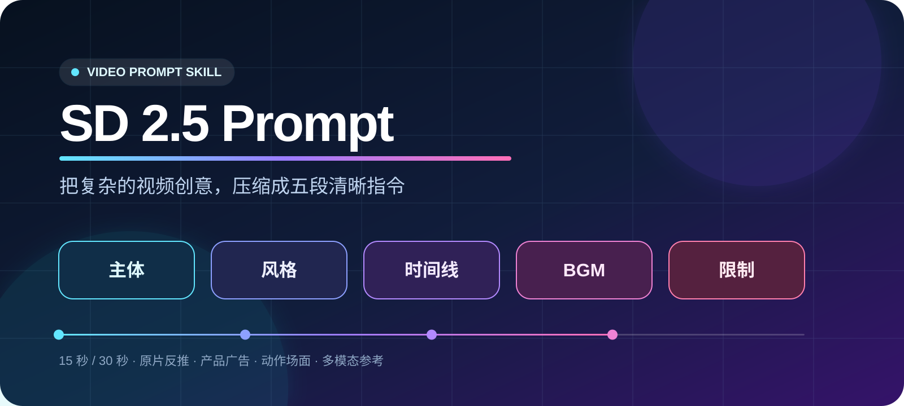

<p align="center">
  
</p>

<p align="center">
  <a href="skills/sd-2-5-prompt/SKILL.md"></a>
  <a href="skills/sd-2-5-prompt/references/examples.md"></a>
  
  
</p>

<h3 align="center">把复杂的视频创意，变成清楚、可拍、可控的五段提示词</h3>

SD 2.5 Prompt 是一套面向 Seedance 2.5 / SD 2.5 视频生成的实用 Skill。它不依赖冗长术语，用五个部分统一处理产品广告、人物动作、原片反推、多模态参考、音乐节奏和复杂打斗。

## 五段式公式

<p align="center">
  
</p>

```text
提示词 = 主体 + 风格 + 时间线 + BGM + 限制
```

| 部分 | 解决什么问题 | 最少要写什么 |
|---|---|---|
| 主体 | 画面到底拍谁、拍什么 | 人物或产品、场景、核心事件、参考素材职责 |
| 风格 | 成片看起来是什么感觉 | 时长、画幅、质感、光线、色彩、镜头节奏 |
| 时间线 | 动作如何从 0 秒发展到结尾 | 每段的起始状态、动作、运镜和结束状态 |
| BGM | 画面如何获得节奏 | 类型、速度、乐器、情绪曲线、关键同步点 |
| 限制 | 哪些错误必须避免 | 只写最相关的 3—8 个风险 |

## 为什么更好用

- **容易记**：只有五部分，写 15 秒广告不用先学一套复杂体系。
- **容易改**：画面不对改“主体/时间线”，节奏不对改“BGM”，稳定性不够改“限制”。
- **覆盖面广**：支持 15 秒、30 秒、产品广告、人物叙事、一镜到底、动作对战和视频延长。
- **动作清楚**：复杂场面才追加“从哪里出发、沿什么路径、作用于谁、落在哪里”。
- **自带检查**：检查时间轴、五部分是否齐全，以及无品牌任务中的常见风险。

## 30 秒上手

把你的创意交给 Skill：

```text
使用 $sd-2-5-prompt，把“一位女孩在清晨厨房做一碗手工面”写成 15 秒视频提示词。
要求中文台词，真实美食质感，节奏明快。
```

它会整理成统一结构：

```text
【主体】谁、产品或道具、场景、核心事件、参考素材职责。

【风格】时长、画幅、清晰度、光线、色彩、质感和镜头节奏。

【时间线】
【0—X秒】起始状态；主体动作；镜头拍法；结束状态。
【X—Y秒】承接上一段；主体动作；镜头拍法；结束状态。
【Y—结尾】高潮或结果；最终英雄画面。

【BGM】类型、速度、乐器、情绪曲线、同步点、对白和关键音效。

【限制】3—8 个最需要避免的问题。
```

完整填空模板见 [五段式公式](skills/sd-2-5-prompt/references/formula.md)。

## 15 个真实参考案例

| # | 案例 | 适合学习 |
|---:|---|---|
| 01 | 键盘高质感 TVC 广告 | 产品连续性、结构拆解、声音节奏 |
| 02 | 麻将厨房短片 | 叙事动作、角色稳定、自然转场 |
| 03 | 女生举枪镜头 | 微表情、手持镜头、情绪递进 |
| 04 | 知识讲解动画 | 版式动效、横版构图、无缝转场 |
| 05 | KPOP 女团 30 秒 MV | 多图片素材分工、角色与场景锁定 |
| 06 | 后期炫酷效果 | 后期特效、音乐卡点、主体保持 |
| 07—09 | 圣托里尼 / 电脑透明 / 去背景 | 局部智能编辑 |
| 10 | 耳机核桃打架视频 | 多角色动作、物理关系、叙事节奏 |
| 11 | 翻译口播效果 | 口播翻译编辑 |
| 12—13 | 视频复刻 | 参考视频、人物替换、创意保留 |
| 14 | Huang Bai 2.5 科技品牌宣传动画 | UI 动效、规模化生成、文字约束 |
| 15 | 鼠标高端 TVC 广告 | 产品广告、运镜触发、材质稳定 |

查看 [15 个真实案例](skills/sd-2-5-prompt/references/examples.md)。案例保留原始提示词；含素材引用时，上传自己的素材后再替换引用。

## 复杂动作只多加一条

普通广告不需要写长篇空间规则。只有打斗、追逐、抛接、液体喷射或多人换位时，补充：

```text
谁发起 + 从哪里出发 + 沿什么路径 + 作用于谁 + 最后落在哪里
```

例如：

```text
A抬手蓄力，金色食物从A手边生成，沿两人之间的直线飞向B；
B面对A举盾格挡，碎屑继续沿A到B的方向飞散。
```

这样可以显著减少攻击从镜头方向出现、人物朝错方向施法、受力方向混乱等问题。

## 安装

克隆仓库后，把 Skill 目录放到你的 Skills 目录中：

```bash
git clone https://github.com/huangbai-AI/sd-2-5-prompt.git
cp -R sd-2-5-prompt/skills/sd-2-5-prompt ~/.codex/skills/
```

然后直接在任务中使用：

```text
使用 $sd-2-5-prompt，把我的创意整理成 15 秒视频提示词。
```

## 自动检查

检查普通 15 秒提示词：

```bash
python3 skills/sd-2-5-prompt/scripts/check_prompt.py prompt.md --duration 15
```

检查无品牌版本：

```bash
python3 skills/sd-2-5-prompt/scripts/check_prompt.py prompt.md --duration 15 --unbranded
```

检查器会发现：

- 时间线未从 0 秒开始、重叠、留空或未覆盖完整时长；
- 缺少主体、风格、BGM 或限制；
- 参考素材没有说明职责；
- 复杂动作缺少路径与落点；
- 无品牌任务出现常见现实品牌词。

## 文件结构

```text
sd-2-5-prompt/
├── README.md
├── docs/images/             # README 视觉素材
└── skills/sd-2-5-prompt/
    ├── SKILL.md                 # 核心工作流
    ├── agents/openai.yaml       # Skill 展示信息
    ├── references/
    │   ├── formula.md           # 五段式模板
    │   ├── examples.md          # 15 个真实案例
    │   └── modes.md             # 反推、延长、一镜到底等模式
    └── scripts/check_prompt.py  # 提示词检查器
```

## 设计原则

> 先让画面关系正确，再让镜头更华丽；先把动作写清楚，再补形容词。

如果提示词很简单，就保持简短。如果动作复杂，再增加路径、来向和落点。Skill 的目标不是把提示词写得最长，而是让每句话都能真正影响成片。
